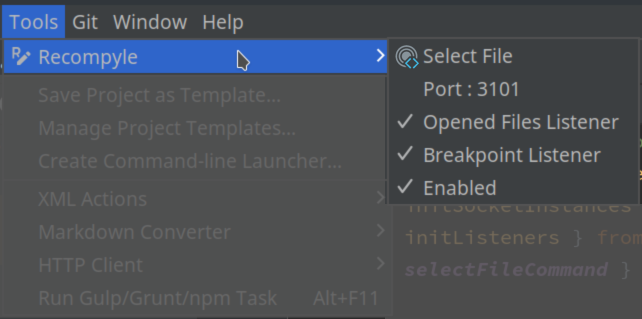

<!-- Plugin description -->
# Recompyle Jetbrains Plugin

A Javascript Developer Friendly Console / Debugger.

This plugin is a bridge between your IDE and the RECOMPYLE App.

You also need the Recompyle App.

[More infos about the Recompyle App](https://github.com/recompyle/recompyle)

### Functionalities of the plugin

- Select a file in Recompyle App.
- Automatically send to Recompyle App the list of the opened files.
- Automatically send to Recompyle App the list of the breakpoints.
- Open a file in the IDE from the Recompyle App.
- Select the port to communicate with the Recompyle App.

### Settings 

#### Menu > Tools  > Recompyle

Each Jetbrains Project has its own settings.

#### Select File icon in the toolbar at the top right

<!-- Plugin description end -->