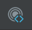

<!-- Plugin description -->
# RECOMPYLE Jetbrains Plugin

A Javascript Developer Friendly Console / Debugger.

This plugin is a bridge between your IDE and and RECOMPYLE App.

More infos on the main repo :  [Recompyle](https://github.com/recompyle/recompyle)

### Menu > Tools  > Recompyle

Each Jetbrains Project has its own settings.

In the toolbar in the top right, there is the icon "Select File"

<!-- Plugin description end -->